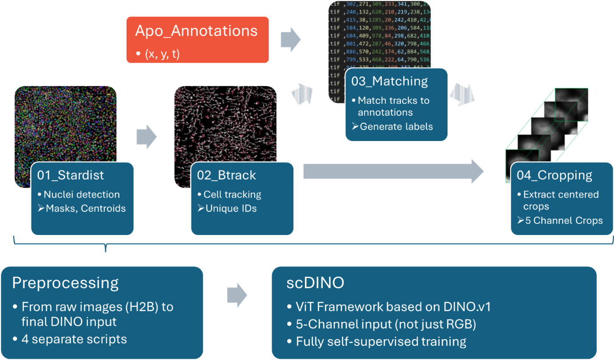
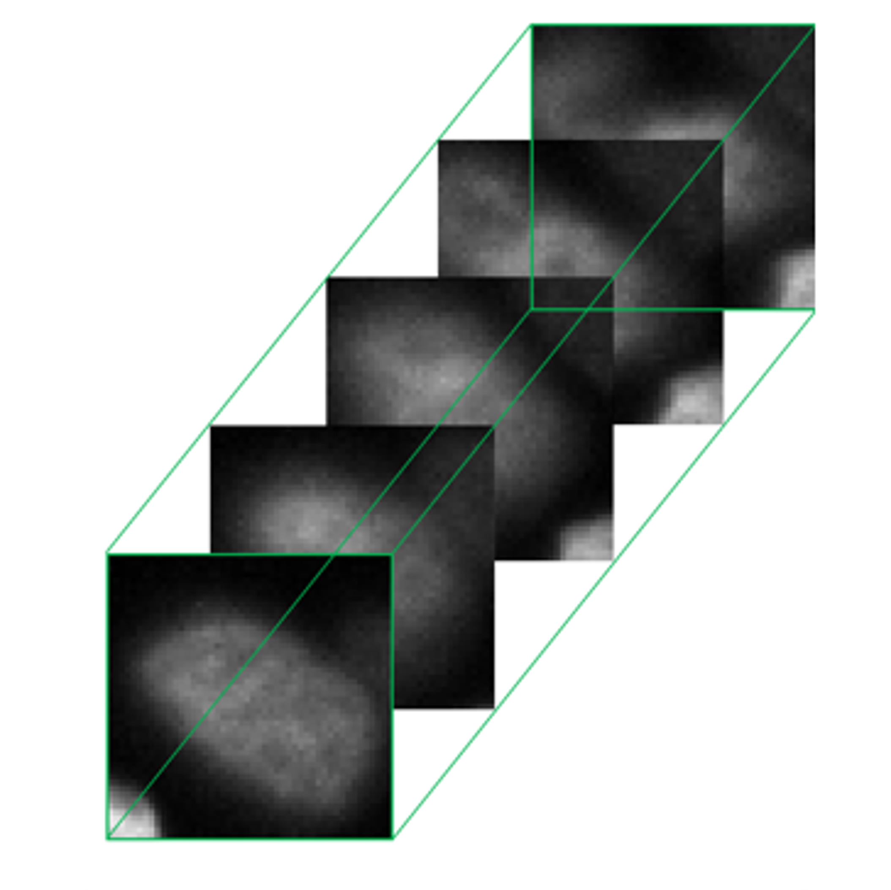
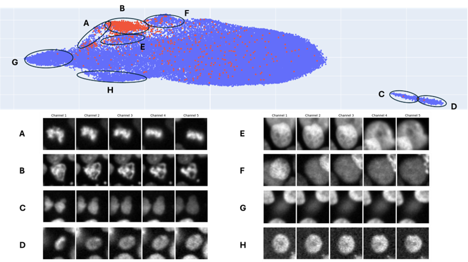

# Single-Cell Time-Series: Centered Temporal Channel Encoding Pipeline

This repository contains the core pipeline for transforming raw, **mono-channel time-series imaging data** into specialized, **multi-channel single-cell datasets** ready for deep learning training and advanced machine learning analysis. The primary function of this pipeline is to **generate standardized single-cell crops** with explicit temporal context.

## Core Methodology: Cell-Centered Temporal Channel Encoding

The central and most critical feature of this pipeline is its ability to convert single-channel (2D + Time) input images into multi-channel (3D) output windows, specifically optimized for single-cell analysis. This process is essential for leveraging and enriching legacy imaging data:

* **Temporal Stacking:** The pipeline stacks images of the *same individual cell* captured at *different, pre-defined sequential timepoints* along the **channel axis**. If $N$ timepoints are stacked with a time interval $\Delta t$, the original 2D image becomes a 3D volume where the channel dimension is $N$.
* **Cell Centering:** Each generated crop is precisely **centered on the cell centroid** across all $N$ timepoints. This ensures the cell remains consistently located in the center of the image, allowing deep learning models to focus on subtle morphological and temporal changes rather than cell movement.
* **Data Enrichment:** This method encodes crucial **temporal context** (e.g., changes over the past $N$ frames) directly into the model's input channels, creating a rich dataset for single-cell analysis.
* **Legacy Data Enablement:** This process allows existing single-channel image archives to be utilized effectively for advanced projects they were not originally designed for.

The generated output is a multi-channel crop $I'(x, y, c)$ where:
$$\text{Output Channel } c_i \text{ is the image of the cell at time } t_0 + i \cdot \Delta t$$

---

## Pipeline Visual Overview

This diagram illustrates the flow from raw data acquisition through the core preprocessing steps—Segmentation, Tracking, Matching, and Cropping—culminating in the final multi-channel, cell-centered dataset.

 
 

    

 

---

## Model Compatibility and Feature Extraction Readiness

This pipeline is engineered to generate training data that is immediately compatible with modern and traditional machine learning methods. By encoding temporal sequences into the channel dimension, the data is pre-optimized for efficient feature extraction:

* **Deep Learning (CNNs & Transformers):**
    * **Convolutional Networks (CNNs):** The multi-channel structure allows standard 2D or 3D convolutional layers to simultaneously extract spatial and temporal features.
    * **Transformer-Based Models:** The data is ideal for attention mechanisms, enabling downstream tasks like phenotype classification.
* **Traditional Machine Learning & Unsupervised Clustering:**
    * The standardized, cell-centered crops enable easy and reliable extraction of **multi-channel quantitative features** (e.g., average intensity, texture descriptors per channel) that capture the cell's dynamics. This prepared feature set can then be used as input for classic ML classifiers (e.g., SVM, Random Forest) or unsupervised clustering algorithms.

---

## Preprocessing Pipeline Performance & Results

The pipeline was validated on an extensive dataset of **219 TIFF files (~420 GB)**. The total processing time for the entire dataset was approximately **68 hours** (less than 10 minutes per GB).

### 1. Segmentation (StarDist)
* **Tool:** StarDist
* **Performance:** Segmentation delivered highly accurate results, implied by a later matching success rate of $>99\%$.
* **Time:** Processing all 219 files required approximately 40 hours (~11 min/file) using GPU support (RTX 4090).

### 2. Tracking (btrack)
* **Tool:** btrack
* **Robustness Enhancement:** A **Sum of Absolute Differences (SAD)-based outlier detection and replacement strategy** was implemented to correct minor, single-frame Field-of-View (FoV) jumps that caused tracking timeouts. This corrected 382 frames, enabling full processing of the entire dataset.
* **Time:** Tracking for all files was completed in approximately **23 hours** (~7 min/file) without parallelization.

### 3. Annotation Matching
* **Goal:** Robustly link expert-provided coordinate annotations $(x, y, t)$ to the generated tracks for downstream labeling.
* **Method:** Instead of a distance-based approach, a custom method extracts a **temporal vector** centered on the expert annotation and uses a **majority vote** across surrounding frames to assign a stable track ID. This methodology is not well suited for objects that displace by more than one radius in two timesteps.
* **Success Rate:** Matching 15,632 expert annotations resulted in a success rate of **$>99\\%$ (15,484 matches)**, providing strong external validation of the segmentation and tracking quality.
* **Time:** The entire matching procedure took approximately **30 minutes** (~0.1 second per annotation).

### 4. Cropping & Artifact Generation
* **Final Configuration:** For the downstream scDINO study, the pipeline generated crops of **$32 \times 32$ pixels** with **five temporal channels** spaced evenly across 20 minutes (intervals of five minutes: $t_0, t_5, t_{10}, t_{15}, t_{20}$).
* **Crop Output & Filtering:**
    * **Apoptotic Crops:** 9,874 valid crops were generated from 13,764 matches (~70% crop rate).
    * **Healthy Crops:** ~300,000 non-apoptotic crops were initially generated, then filtered using thresholds on features (eccentricity, solidity, intensity) to yield a final count of **258,683 healthy crops**.
* **Time:** Cropping was completed in ~4.5 hours (~70 s per file).

Preprocessing of the entire dataset was completed in imately 68 hours in total (18 minutes per file, less than 10 minutes per GB).

 
 

    

 

---

## Downstream Application Example: scDINO Latent Space Exploration

The output from this preprocessing pipeline served as the foundation for self-supervised training of a model with the **[scDINO framework](https://github.com/JacobHanimann/scDINO)**, which extends **[DINO](https://github.com/facebookresearch/dino)** to more than three channels. This section is only here as an example how the produced data can be utilized , if you are interested in the code go check out the linked repositories.

### scDINO Training & Analysis Highlights
* **Unsupervised Feature Extraction:** The temporal channel-encoded crops served as the direct input to the scDINO Vision Transformer (ViT). The model learned rich, self-supervised representations that capture both morphology and temporal dynamics.
* **Latent Space Exploration (UMAP):** The UMAP projection of the latent space embeddings from the validation dataset revealed a highly structured space, demonstrating the model's ability to cluster distinct cell states. The coloring was added post-hoc for visualization:
    * **Biological Clusters (A-D):** Latent space exploration revealed specific regions for **apoptotic cells (B)**, and detailed clusters for various phases of **mitosis**: metaphase to anaphase (A), telophase to cytokinesis (C), and a potentially novel cell state characterized by abortive mitosis during metaphase (D).
    * **Technical/Artifact Clusters (E-H):** The model also successfully separated crops corresponding to technical failures, underlining the robustness of the temporal encoding. These clusters included crops with **tracking errors** consistently appearing in specific frames (E and F), cells out of the **focal plane (G, epithelial extrusion)**, and crops displaying a characteristic **grainy texture** likely due to imaging artifacts (H).

This application demonstrates the pipeline's effectiveness in generating training data optimized for state-of-the-art unsupervised representation learning in single-cell microscopy.

 
 

    

 

---

## Citations and Acknowledgements

This pipeline relies on several fundamental open-source tools and published methodologies:

* **Segmentation** was performed using [StarDist](https://github.com/stardist/stardist) (Schmidt et al., 2018).
* **Tracking** utilized [btrack](https://github.com/quantumjot/btrack) (Ulicna et al., 2021) which was adapted for robustness against FoV jumps.
* **Downstream Application** [scDINO](https://github.com/JacobHanimann/scDINO) (Pfaendler et al., 2023) is an adaptation of the original self-supervised learning model [DINO](https://github.com/facebookresearch/dino) (Caron et al., 2021). The resulting embeddings were visualized using [UMAP](https://github.com/lmcinnes/umap) (McInnes et al., 2018).

This project was developed as a Master thesis in the [PertzLab](https://github.com/pertzlab) at the University of Bern, Switzerland. If you like this project, are into automated microscopy or interested in dynamic signalling you might like to have a look at some of our other projects:
* **[ARCOS](https://github.com/pertzlab/ARCOS)** automatically detects collective events like waves of protein activity propagating through a tissue. Is also available as a [plug-in for napari](). Also check out the newest member in the ARCOS-ecosystem, [ARCOS.px](https://github.com/pertzlab/arcosPx-napari)
* **[rtm-pymmcore](https://github.com/pertzlab/rtm-pymmcore)** lets you communicate with your microscope in real time in python.
* **[fabscope](https://github.com/hinderling/fabscope)** turns your microscope into a 3d printer.
